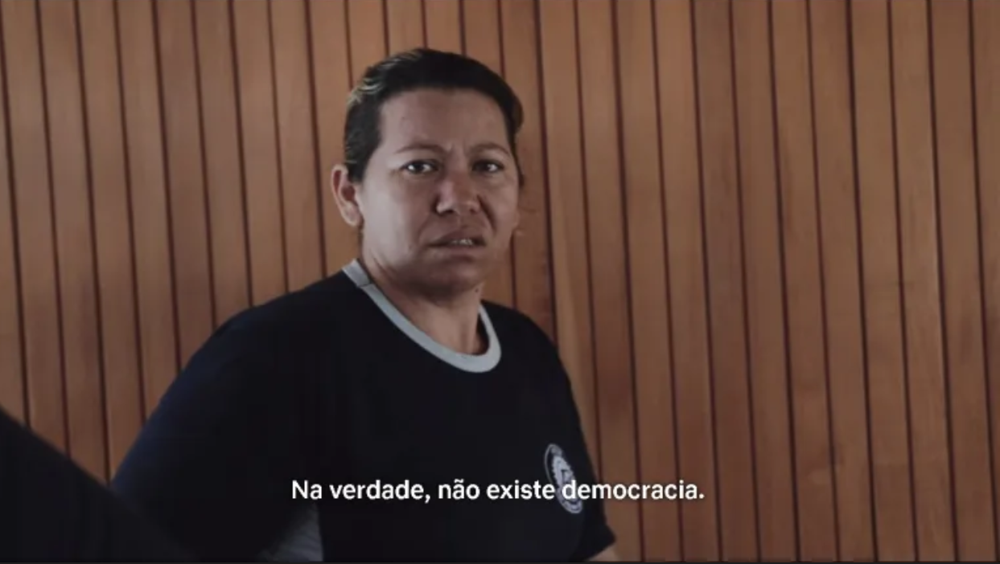
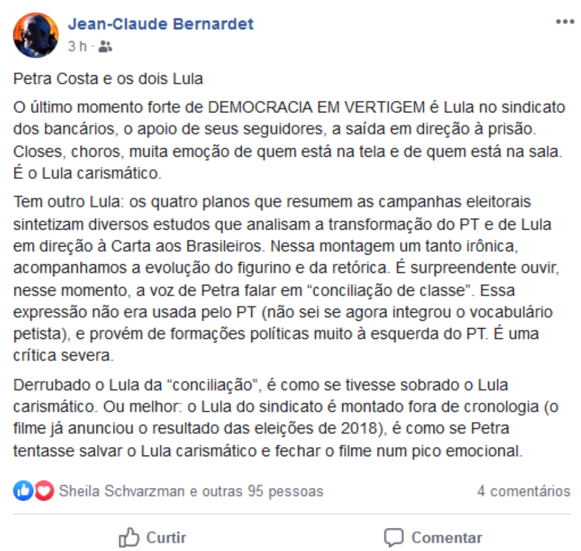

> “Condenem-me, não importa, a História me absolverá” (Fidel Castro)
>
>  “Todos nós seremos julgados pela História” (Dilma Rousseff)

Petra Costa faz um filme íntimo, ligando seu próprio passado ao passado do país. A obra é bem feita tecnicamente e consegue extrair de seu material fonte um espetáculo imagético e com grandes qualidades representativas.

A diretora soube bem apontar seu ponto de vista e o lugar social de onde fala (neta do fundador do Grupo Andrade Gutierrez), ou seja, numa posição social privilegiada dentro da burguesia capitalista. Isso posto, podemos nos adentrar a planos mais profundos que o documentário nos permite discutir.

O recorte temporal do filme vai desde a redemocratização até a eleição de Bolsonaro, perpassando a primeira eleição de Lula, as manifestações de junho de 2013 e o golpe de 2016. Os focos narrativos estão nos presidentes petistas, e os poucos espaços de crítica ao seus governos são superficiais e focados na questão da estrutura política e da institucionalidade.

É um posicionamento esperado, uma vez que cada vez mais o discurso liberal progressista nos moldes capitalistas está se tornando hegemônico na esquerda brasileira. O que mais chama atenção é que o documentário relativiza o período de governo do PT como um período realmente democrático na história do Brasil. A questão social do governo é negligenciada: pobres, negros, periféricos, LGBT+, mulheres, indígenas, quilombolas, sem terra, sem teto sempre estiveram na margem do jogo “democrático” brasileiro, inclusive nos governos petistas, em que a retaliação estatal conseguiu alcançar o seu auge.

Uma frase emblemática que pode sintetizar esse ponto de vista é a fala de Lula:

> “Temos séculos de preconceitos, sabe? Séculos de **dominação da casa grande**, a senzala sempre foi muito mal tratada. Reverter tudo isso é uma coisa difícil e nem sempre dá certo, mas quando tem uma **revolução** metade morre em batalha, metade foge. Ai você pensa que pode fazer tudo, em muitos países se conseguiu fazer. **Agora fazer como nós fizemos,** **com democracia**, com liberdade de imprensa, com direito de greve, com direito de manifestação, com o congresso funcionando livremente…É muito mais difícil, mas é mais compensador. Porque…A gente vai aprendendo o que que é os **valores da democracia**” (Fala de Luiz Inácio Lula da Silva para o documentário Democracia em Vertigem).

Vemos aqui a romantização da democracia burguesa, que sempre busca o consenso para legitimar suas atrocidades, colocando para si uma carapaça extremamente poderosa no discurso atual: “democracia”. Os governos petistas são vistos pelo documentário enquanto tempos de prosperidade, de conquistas e, principalmente, de democracia.

A democracia nunca esteve em vertigem, ela sempre foi o que pretendia ser: “estreita, amputada, falsa, hipócrita, paraíso para os ricos, uma armadilha e um engano para os explorados, para os pobres”[1]. Com isso podemos perceber que os anos de governo petistas se propuseram a entrar nesse jogo “democrático”, e não acabar com ele. A opressão de classe continua e sempre continuará na dita “democracia”.

> “Assim dizia Lenin: não se pode falar de “democracia pura” enquanto existirem _classes_ diferentes, pode-se falar apenas de democracia _de classe._ Lenin recupera os ensinamentos de Marx e Engels sobre o Estado, que será sempre a expressão política da dominação de uma classe sobre as outras”. [2]

E quem mais sofre com essa dominação vocês já sabem!

Uma fala interessante sobre o documentário é a de **Jean-Claude Bernardet** (teórico do cinema brasileiro) em seu perfil no Facebook:

## REFERÊNCIAS BIBLIOGRÁFICAS:

**[1] Lênin. Capítulo da brochura “A Revolução Proletária e o Renegado Kautsky”:** **[https://www.cienciasrevolucionarias.com/post/democracia-burguesa-e-democracia-prolet%C3%A1ria](https://www.cienciasrevolucionarias.com/post/democracia-burguesa-e-democracia-prolet%C3%A1ria)**

**[2] Lenin: Democracia Burguesa e Democracia Proletária:** **[https://pcb.org.br/portal2/11138/lenin-democracia-burguesa-e-democracia-proletaria/](https://pcb.org.br/portal2/11138/lenin-democracia-burguesa-e-democracia-proletaria/)**

DICA:

**[TV Boitempo] Léxico Marx #3 | DITADURA DO PROLETARIADO | Antonio Carlos Mazzeo:** [https://www.youtube.com/watch?v=rzwj5rlOklo](https://www.youtube.com/watch?v=rzwj5rlOklo)